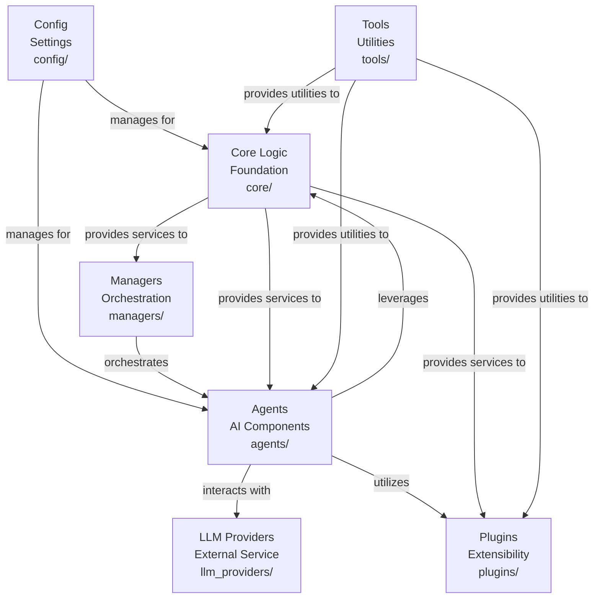
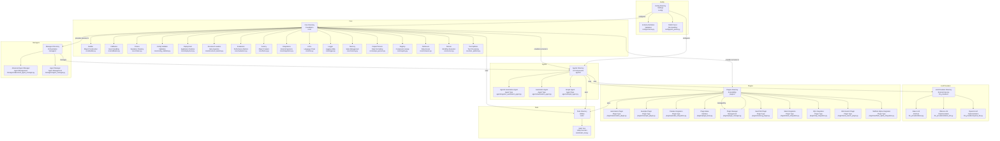

# Codebase Research Report

## Query
create diagramm directory modular-2

## Answer
# Codebase Overview: modular-2

This report provides a structured overview of the `modular-2` codebase, detailing its main components and their interrelationships. The project appears to be a modular Python application, likely involving AI agents, configuration management, core functionalities, LLM integrations, and a plugin system.

## High-Level Architecture

The `modular-2` project is organized into several top-level directories, each encapsulating a distinct functional area. The core logic resides within the [core](core/) directory, which provides foundational services. [Agents](agents/) leverage these core services, often interacting with [LLM Providers](llm_providers/) and utilizing functionalities exposed through [Plugins](plugins/). Configuration is managed centrally in the [config](config/) directory, while [Managers](managers/) orchestrate the behavior of agents. [Tools](tools/) provide utility functions that can be used across different modules.

-   **[agents](agents/)**: Contains the definitions and implementations of various AI agents.
-   **[config](config/)**: Manages application configuration, including schema validation and parsing.
-   **[core](core/)**: Houses the fundamental building blocks and shared functionalities of the application.
-   **[llm_providers](llm_providers/)**: Provides interfaces and implementations for different Large Language Model (LLM) providers.
-   **[managers](managers/)**: Orchestrates and manages the lifecycle and interactions of agents.
-   **[plugins](plugins/)**: Implements a pluggable architecture, allowing for extensible functionalities and integrations.
-   **[tools](tools/)**: Contains utility functions and helper modules.
-   **[tests](tests/)**: Holds unit and integration tests for the various components.

## Mid-Level Component Details

### Agents

The [agents](agents/) directory defines the different types of AI agents within the system. These agents are likely responsible for executing specific tasks or workflows, often leveraging LLMs and plugins.

-   **Purpose**: To encapsulate distinct AI-driven behaviors and decision-making logic.
-   **Internal Parts**:
    -   [agentic_automation_agent.py](agents/agentic_automation_agent.py): Likely an advanced agent capable of automated task execution.
    -   [automation_agent.py](agents/automation_agent.py): A more general automation agent.
    -   [simple_agent.py](agents/simple_agent.py): A basic agent implementation.
-   **External Relationships**: Agents interact with [llm_providers](llm_providers/) for language model capabilities and utilize functionalities provided by [plugins](plugins/). They are managed by components in the [managers](managers/) directory.

### Config

The [config](config/) directory is responsible for handling the application's configuration. This includes defining configuration schemas and parsing configuration files.

-   **Purpose**: To provide a structured and validated way to manage application settings.
-   **Internal Parts**:
    -   [schema.py](config/schema.py): Defines the data structures and validation rules for configuration.
    -   [yaml_parser.py](config/yaml_parser.py): Handles parsing of YAML-based configuration files.
-   **External Relationships**: Core components and agents likely load their settings from the configuration managed here.

### Core

The [core](core/) directory contains the foundational components and shared utilities that are essential for the entire application.

-   **Purpose**: To provide reusable building blocks and common services for other modules.
-   **Internal Parts**:
    -   [builder.py](core/builder.py): Likely responsible for constructing complex objects or workflows.
    -   [callbacks.py](core/callbacks.py): Implements callback mechanisms for event handling.
    -   [chains.py](core/chains.py): Suggests a system for chaining operations or prompts.
    -   [config_validator.py](core/config_validator.py): Validates configuration against defined schemas.
    -   [deployment.py](core/deployment.py): May contain logic related to deploying or running the application.
    -   [document_loaders.py](core/document_loaders.py): Handles loading various types of documents.
    -   [evaluators.py](core/evaluators.py): Provides mechanisms for evaluating outputs or performance.
    -   [factory.py](core/factory.py): Implements factory patterns for creating objects.
    -   [integrations.py](core/integrations.py): Manages general integrations with external systems.
    -   [lcel.py](core/lcel.py): Potentially related to a "Language Chain Expression Language" or similar.
    -   [logger.py](core/logger.py): Provides logging functionalities.
    -   [memory.py](core/memory.py): Manages application-level memory or state.
    -   [output_parsers.py](core/output_parsers.py): Parses and formats outputs from various processes.
    -   [registry.py](core/registry.py): A central registry for components or services.
    -   [retrievers.py](core/retrievers.py): Implements data retrieval mechanisms.
    -   [runner.py](core/runner.py): Executes workflows or tasks.
    -   [text_splitters.py](core/text_splitters.py): Splits text into smaller chunks for processing.
-   **External Relationships**: Almost all other directories depend on components within `core` for fundamental operations.

### LLM Providers

The [llm_providers](llm_providers/) directory abstracts interactions with different Large Language Models.

-   **Purpose**: To provide a unified interface for accessing various LLM services.
-   **Internal Parts**:
    -   [base.py](llm_providers/base.py): Defines the base interface or abstract class for LLM providers.
    -   [ollama_llm.py](llm_providers/ollama_llm.py): Implementation for Ollama LLM.
    -   [openai_llm.py](llm_providers/openai_llm.py): Implementation for OpenAI LLM.
-   **External Relationships**: [Agents](agents/) and potentially other modules interact with these providers to leverage LLM capabilities.

### Managers

The [managers](managers/) directory is responsible for overseeing and coordinating the activities of agents.

-   **Purpose**: To manage the lifecycle, execution, and interaction of agents.
-   **Internal Parts**:
    -   [advanced_agent_manager.py](managers/advanced_agent_manager.py): Manages more complex agent types.
    -   [agent_manager.py](managers/agent_manager.py): A general manager for agents.
-   **External Relationships**: Managers interact directly with [agents](agents/) and may utilize [core](core/) services for their operations.

### Plugins

The [plugins](plugins/) directory implements a flexible plugin system, allowing the application to extend its functionality dynamically.

-   **Purpose**: To provide a modular and extensible architecture for adding new features or integrations.
-   **Internal Parts**:
    -   [automation_plugin.py](plugins/automation_plugin.py): A plugin for automation tasks.
    -   [example_plugin.py](plugins/example_plugin.py): An example demonstrating plugin structure.
    -   [pandas_integration.py](plugins/pandas_integration.py): Integrates with the Pandas library.
    -   [plugin_base.py](plugins/plugin_base.py): Defines the base class or interface for all plugins.
    -   [plugin_manager.py](plugins/plugin_manager.py): Manages the loading, registration, and execution of plugins.
    -   [searxng_plugin.py](plugins/searxng_plugin.py): Integrates with SearXNG for search capabilities.
    -   [slack_integration.py](plugins/slack_integration.py): Integrates with Slack.
    -   [sql_integration.py](plugins/sql_integration.py): Provides SQL database integration.
    -   [web_search_plugin.py](plugins/web_search_plugin.py): A plugin for web search functionality.
    -   [wolfram_alpha_integration.py](plugins/wolfram_alpha_integration.py): Integrates with Wolfram Alpha.
-   **External Relationships**: Plugins can be utilized by [agents](agents/) or other core components to extend their capabilities. The [plugin_manager.py](plugins/plugin_manager.py) is central to their operation.

### Tools

The [tools](tools/) directory contains various utility functions that can be used across the project.

-   **Purpose**: To provide small, reusable functionalities that don't fit into larger modules.
-   **Internal Parts**:
    -   [math_tool.py](tools/math_tool.py): Provides mathematical utility functions.
-   **External Relationships**: These tools can be imported and used by any other module in the project.

---
*Generated by [CodeViz.ai](https://codeviz.ai) on 7/6/2025, 7:38:40 AM*
